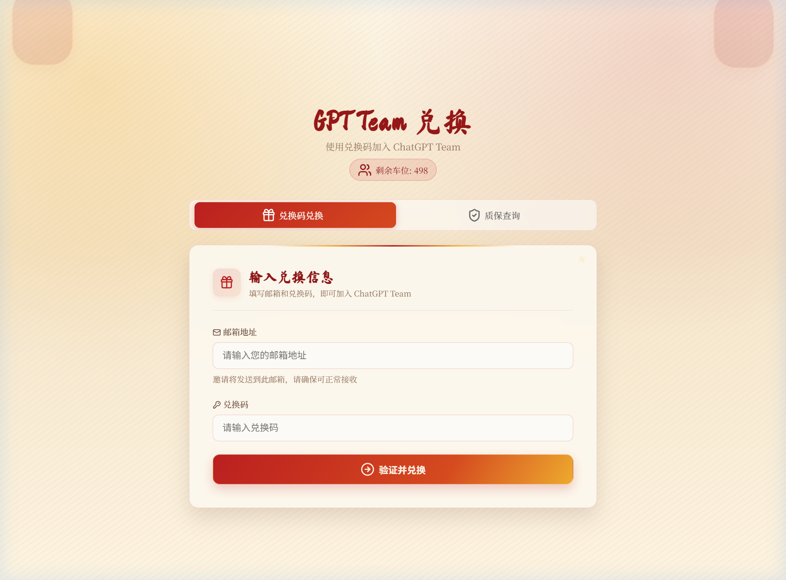
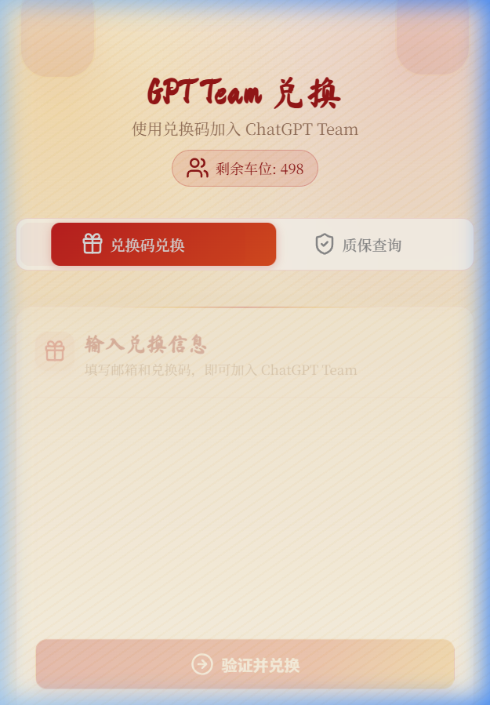

# codextm.xyz 网站设计分析

> 分析日期：2026-03-25  
> 网址：https://codextm.xyz/

---

## 📸 页面截图

### 桌面端视图


### 移动端视图


---

## 一、整体概述

codextm.xyz 是一个 **GPT Team 兑换码平台**，用户通过输入邮箱和兑换码加入 ChatGPT Team。整个页面采用了**新春特别版**主题风格，视觉上融合了中国传统节日元素与现代 UI 设计，呈现出一种**温暖、喜庆、精致**的感觉。

页面为**单页应用 (SPA)**，核心交互集中在一个中央卡片组件上，结构简洁但设计精美。

---

## 二、页面结构

```
┌─────────────────────────────────────────┐
│              装饰性背景光晕               │
│                                         │
│        🎨 GPT Team 兑换 (书法标题)        │
│        使用兑换码加入 ChatGPT Team         │
│           [ 🧑‍🤝‍🧑 剩余车位: 498 ]          │
│                                         │
│  ┌───────────────────────────────────┐  │
│  │  [兑换码兑换]        [质保查询]     │  │  ← Tab 导航
│  ├───────────────────────────────────┤  │
│  │                                   │  │
│  │  🎁 输入兑换信息                    │  │  ← 表单区域
│  │  📧 邮箱地址  [_____________]      │  │
│  │  🔑 兑换码    [_____________]      │  │
│  │                                   │  │
│  │  [ ⏩ 验证并兑换 ]                 │  │  ← 渐变按钮
│  │                                   │  │
│  └───────────────────────────────────┘  │
│                                         │
│              装饰性背景光晕               │
└─────────────────────────────────────────┘
```

### 功能模块

| 模块 | 功能 | 说明 |
|------|------|------|
| **英雄区 (Hero)** | 品牌展示 | 书法标题 + 副标题 + 剩余车位徽章 |
| **兑换码兑换** | 核心功能 | 输入邮箱和兑换码，验证后加入 Team |
| **质保查询** | 售后保障 | 封号后凭兑换码重新加入 Team |
| **LinuxDo 登录** | 用户体系 | 签到积分 · 积分商城 · 免费车位 |

---

## 三、配色方案

### 主色调

| 角色 | 颜色 | 色值 (近似) | 用途 |
|------|------|------------|------|
| 🔴 主色 | 深红色 | `#8B2500` ~ `#A52A2A` | 标题文字、图标、活跃 Tab |
| 🟠 强调色 | 暖金/橙色 | `#D4740A` ~ `#E8A735` | 按钮渐变右端、装饰元素 |
| 🟡 背景基色 | 暖米色 | `#FDF7F2` ~ `#FFF5E6` | 页面整体背景 |
| ⬜ 卡片白 | 半透明白 | `rgba(255,255,255,0.85)` | 主卡片背景 |
| 🔘 辅助灰 | 浅灰 | `#999` ~ `#CCC` | 未激活 Tab、占位文字 |

### 渐变使用

```css
/* 主按钮渐变 - 从深红到暖金 */
background: linear-gradient(135deg, #C0392B, #E67E22, #F39C12);

/* 活跃 Tab 渐变 */
background: linear-gradient(135deg, #E74C3C, #E8A735);

/* 背景装饰光晕 */
background: radial-gradient(circle, rgba(231,76,60,0.3), transparent 70%);
```

---

## 四、字体排版

| 元素 | 字体 | 大小 (近似) | 风格 |
|------|------|-----------|------|
| 主标题「GPT Team 兑换」| **Ma Shan Zheng** (马山正书法) | ~48px | 深红色，中国毛笔书法风格 |
| 副标题 | PingFang SC / 系统无衬线 | ~16px | 浅灰色，常规粗细 |
| 表单标签 | PingFang SC / Inter | ~14px | 深灰色，带 SVG 图标前缀 |
| 按钮文字 | 系统无衬线 | ~16px | 白色，加粗 |
| 徽章文字 | 系统无衬线 | ~14px | 深红色 |

> 💡 **亮点**：标题使用中式书法字体是整个设计的灵魂，赋予页面浓郁的节日氛围，同时与现代 UI 形成优雅的反差。

---

## 五、UI 组件详解

### 1. 装饰性背景光晕
- 页面四角分布有柔和的**模糊红橙色圆形光斑**
- 使用 `radial-gradient` 或 `blur` 滤镜实现
- 营造温暖的节日氛围，不抢夺主体内容注意力

### 2. 剩余车位徽章
- 胶囊形状 (`border-radius: 999px`)
- 浅粉色背景 + 深红色边框
- 带用户图标 SVG，显示实时数量

### 3. Tab 切换导航
- 双 Tab 设计：「兑换码兑换」/「质保查询」
- 活跃态：红金渐变背景 + 白色文字
- 非活跃态：透明背景 + 灰色文字
- Tab 前方带 SVG 图标 (礼物盒 / 盾牌)
- 切换时有平滑的 CSS 过渡动画

### 4. 主卡片容器
- 圆角矩形 (`border-radius: ~16px`)
- 半透明白色背景（玻璃拟态风格）
- 柔和投影 (`box-shadow`)
- 内含表单元素和操作按钮

### 5. 表单输入框
- 圆角边框 (`border-radius: ~8px`)
- 浅灰色 1px 边框，获焦时可能变为红色
- 内置 placeholder 提示文字
- 标签使用 SVG 图标 + 文字的组合

### 6. 主操作按钮「验证并兑换」
- 全宽渐变按钮（红 → 橙 → 金）
- 圆角 (`border-radius: ~8px`)
- 白色文字 + 箭头图标
- 悬停时可能有亮度/阴影变化

---

## 六、设计风格总结

| 维度 | 特点 |
|------|------|
| **整体风格** | 新春节日主题 + 现代极简主义 |
| **设计语言** | 轻量玻璃拟态 (Light Glassmorphism) |
| **文化元素** | 书法字体、红金配色、温暖色调 |
| **布局策略** | 垂直居中、单卡片聚焦、减少干扰 |
| **交互设计** | 极简操作 — 两个输入 + 一个按钮完成核心流程 |
| **装饰手法** | 渐变光晕 + 圆角 + 投影 = 精致而不花哨 |

---

## 七、响应式设计

- **桌面端**：卡片居中，宽度约 600-700px，两侧留白充足
- **移动端**：卡片扩展至接近满屏宽度，Tab 自适应调整
- **表单布局**：在移动端保持单列布局，按钮固定至底部区域
- 整体使用 `max-width` + `margin: auto` 的经典居中方案

---

## 八、值得借鉴的设计技巧

1. **书法字体做标题** — 一招制胜，瞬间提升辨识度与文化气质
2. **温暖渐变背景光晕** — 低成本营造氛围感，不需要图片素材
3. **红金渐变按钮** — 视觉吸引力强，节日主题的标志性配色
4. **胶囊徽章展示关键数据** — 实时显示「剩余车位」，制造稀缺感
5. **极简交互流程** — 仅两步操作 (输入 → 兑换)，降低用户认知负担
6. **Tab 页内嵌表单** — 将兑换和质保合理分区，页面不冗长
7. **半透明卡片 + 柔和阴影** — 轻量玻璃拟态让界面有层次但不沉重

---

## 九、技术实现要点 (推测)

```
前端框架：Vue.js / React (SPA 架构)
样式方案：CSS 变量 + 渐变 + 模糊滤镜
字体加载：Google Fonts (Ma Shan Zheng)
图标系统：内联 SVG (线条风格)
动画效果：CSS Transitions (Tab 切换、按钮悬停)
响应式：Media Queries + Flexbox/Grid
API 对接：RESTful (兑换验证、车位查询)
```

---

*此文档由自动化分析生成，配色值为近似推测。如需精确值请使用 DevTools 检查。*
